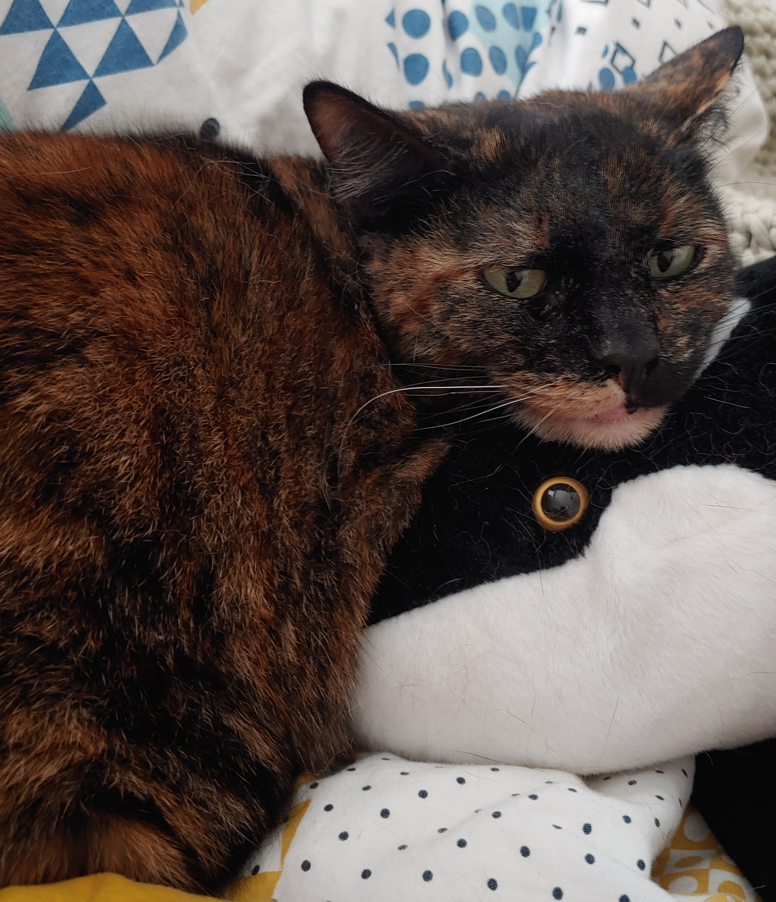
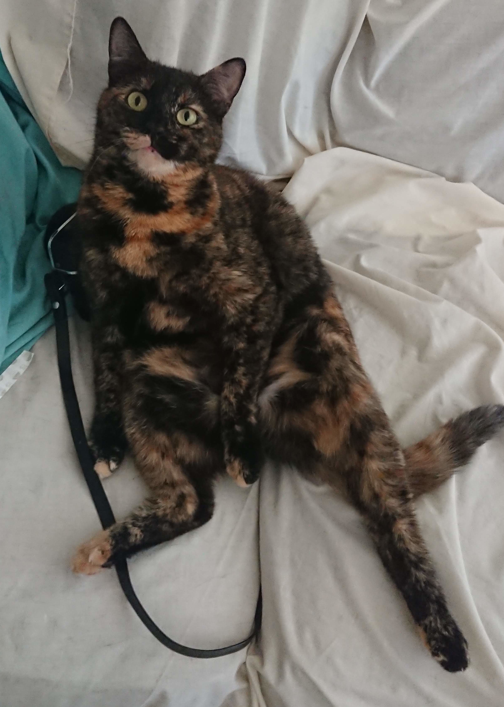
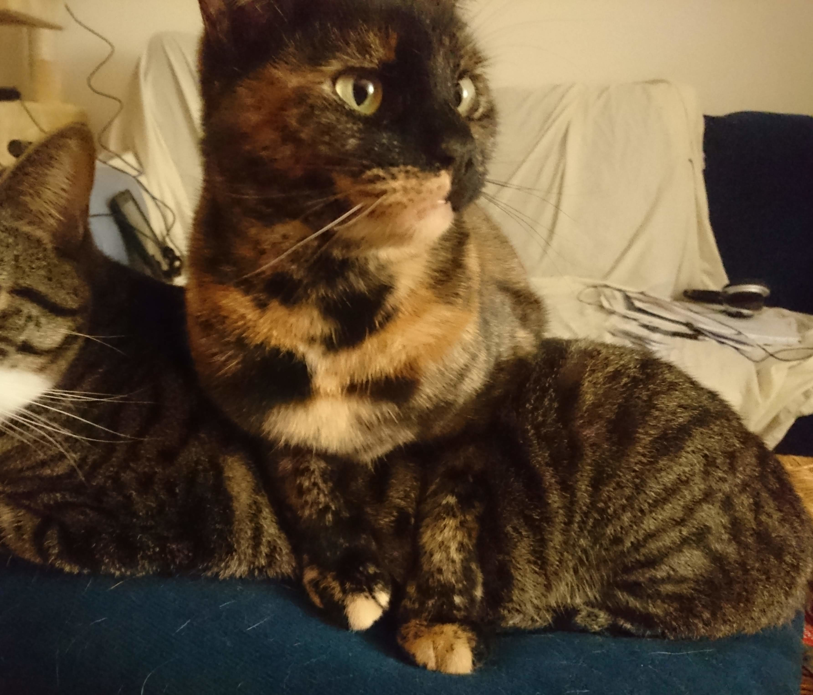
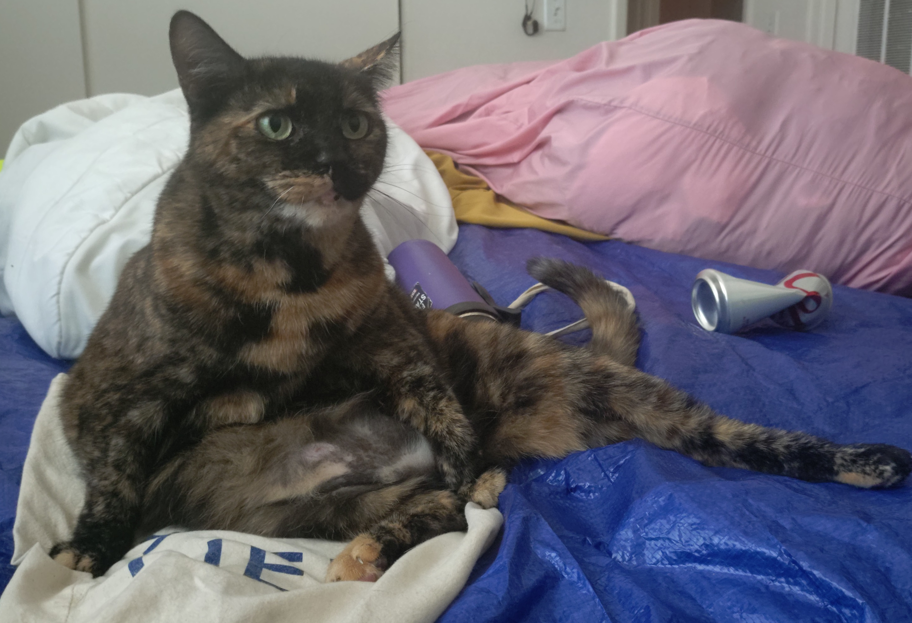

Tai (aka "Thái Cực" aka "Merrida" aka "Bleachy Towel")
is a cuddly af 8 and a half year-old calico originally from South Brooklyn,
and she needs a new place to live. 

{height=350px}
{height=350px style="float:right;display:block;"}

Do you have a peaceful home and want a cat cuddling you every night?
 
Email me at " usual.flag9239 " at that " fastmail.com " to meet Tai.

{height=600px}
{height=600px style="float:right;display:block;"}

Tai and her brother were caught when they were about 6-months old, and
after a vet workup/spay/nuetering I adopted the two of them.
They moved with me out to California. They've been living with me indoors
the whole time.

I think Tai is the smart and perceptive one of the pair. 
She's certainly the most gentle.
While she doesn't like to get picked up (she wiggles and grubmles),
she really likes to climb on top of me when I lie down.
Your mileage may vary, but I'm used to her jumping on top of me in about 1-5 
minutes after I go to bed, every night.
So if you want a cuddly fur baby cat, that's Tai.

**The problem** is that her brother (grey cat pictured) is aggressive and 
excited and I can't seem to tire him out enough to keep him from 
play-attacking Tai.
The vet recommended feeding the brother cat psychiatric meds, but I instead
figure that it's finally time to break up the band and split the pair.
I love both these cats dearly, but since Tai is the most mellow-mannered, 
chill, and "cat-like" of the two I figured it'd be easier to find her a calm
and safe home to enjoy - with you!

Tai is in good health. I just got her some optional dental work done at the 
vet (Feb 4th 2025), some teeth cleaning and optional 
[FORL](https://www.vet.cornell.edu/departments-centers-and-institutes/cornell-feline-health-center/health-information/feline-health-topics/tooth-resorption) 
extractions. 
She was a little overweight last year, but at last weigh-in she was 
within normal range.
She has had a UTI in the past, so on the vet's recommendation I make sure to
add 2 tablespoons of water to her food to make sure she's drinking enough 
water. This might not be of any use when she's on her own, as she should have
safer/calmer access to water without her brother around.
Tai has had whatever vaccines the vet offered, she's spayed, and she also has 
a microchip (that of course we can re-register to you).

When her brother's not around, Tai likes to play with string or little stuffed 
animals. She'll do the thing where she'll paw at it and then leap in the air
in suprise. She loves the laser and treats and eating.
I've fed them Friskie's pate forever, and used to feed them boiled chicken
breast regularly.
To warn you, I caught her once eating a loaf of bread - she chewed through the
plastic and was gorging herself on the carbs. So you might have to hide your
bread loaves. Also cooked pasta, she'll eat pasta if you give it to her
(she does not know how to prepare it herself!), but of course she prefers
any sort of meat/fish/broth or any dairy products (cheese, yogurt, cottage 
cheese, egg). She does seem to respond a bit to catnip, and she does enjoy a
nice cat grass salad.

I call her Tai as short for Thái Cực.
"Thái Cực", I believe, is the Vietname words for what is more commonly written
in English as Tai Chi, which I believe is the tradition that involves the 
yin-yang symbol. 
I decided to call her that because her face reminds me of a yin-yang, 
with the light and dark fur in a swirl around her chin/mouth/upper-lip.
She is also the "yin" to her brothers "yang", she flows around conflict.

I very much love this cat and want to find her a happy and harmonious 
long-term loving home. So, if you take her for a while but then decide that
it's not a good fit, I will definitely take her back to make sure she's in
a happy spot. 

So if you've got room in your heart and home for this lovely 8.5 year-old cat,
preferrably with a warm spot in the sunlight, 
please email me to set up a visit.

